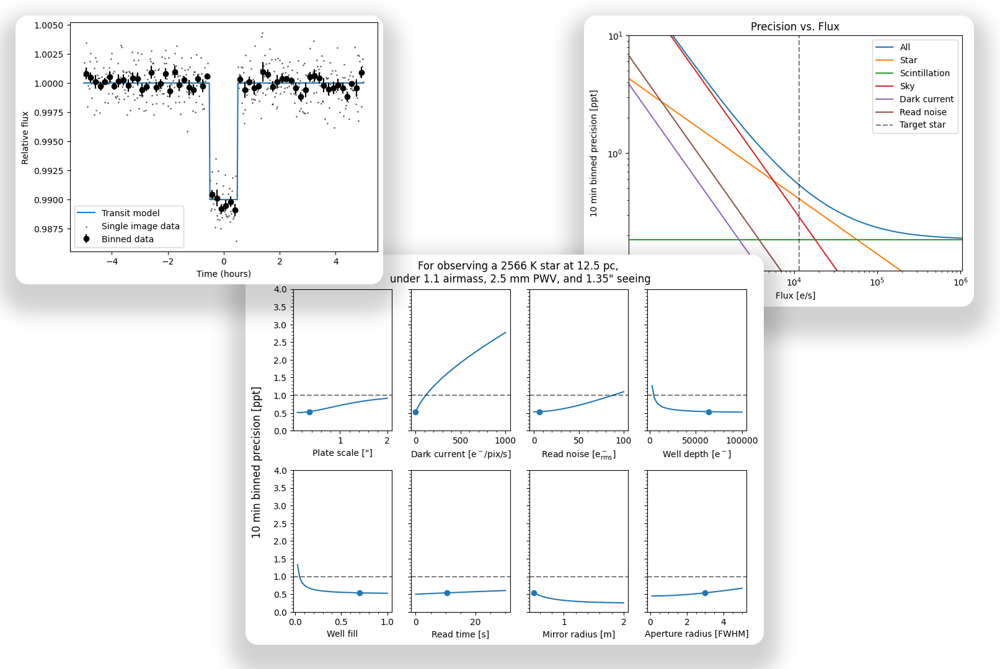

# mphot
*mphot* is a Python package to model photometry for ground or space-based astronomy. Exposure time calculator (ETC) built in.




## How it works

Simply put,
- it combines user submitted [telescope * filter * camera qe] efficiencies with generic stellar models and sky transmission/radiance models (for Paranal, 2400m) to generate integrable grids of stellar fluxes and sky radiances.

- Then, *mphot* uses the grids to interpolate between different
    - atmospheric parameters (PWV, airmass)
    - target star parameters (effective temperature + distance)

- using user submitted
    - telescope/site parameters (primary and secondary diameters, site seeing, sky brightness relative to Paranal with `sky_factor`)
    - camera parameters per unbinned pixel (plate scale, dark current, read noise, well depth, target well fill, read time), and the binning with `pixel_binning` and `pixel_binning_type` (`"digital"` for CMOS, `"on-chip"` for CCD)

- to calculate the ideal exposure time and expected precision for a given observation.

Please see the [examples](https://github.com/ppp-one/mphot/tree/main/examples) for more details on how to use *mphot*. For further details on the models used, please see [https://doi.org/10.1117/12.3018320](https://doi.org/10.1117/12.3018320).

Note, it uses stellar parameters from "[A Modern Mean Dwarf Stellar Color and Effective Temperature Sequence](https://www.pas.rochester.edu/~emamajek/EEM_dwarf_UBVIJHK_colors_Teff.txt)".


## Galaxies and nebulae

*mphot* also calculates exposures for images of galaxies and nebulae. Give the Messier, NGC or IC name and the SNR that you need:

```python
import mphot

name, _ = mphot.generate_system_response(
    "resources/systems/speculoos_Andor_iKon-L-936_-60.csv", "resources/filters/r.csv"
)
props = {
    "name": name, "plate_scale": 0.35, "N_dc": 0.2, "N_rn": 6.328,
    "well_depth": 64000, "well_fill": 0.7, "read_time": 10.5, "r0": 0.5, "r1": 0.14,
}
props_sky = {"pwv": 2.5, "airmass": 1.2, "seeing": 1.35}

plan = mphot.get_exposure_extended("M51", props, props_sky, snr=10)
print(plan["t_sub [s]"], plan["subs"])  # 94.5 s, 10 sub-exposures
```

The sub-exposure is the shortest time that meets two conditions:

- It is background-limited: the sky and dark variance is 10 times the read-noise variance. The read noise then adds less than 5% to the noise.
- The readout uses no more than 10% of the total time.

The sub-exposure is shorter if the brightest part of the target fills the well to `well_fill`. If one exposure gives the SNR, *mphot* uses one exposure, because each readout adds read noise. To use a fixed sub-exposure time, set `min_exp` and `max_exp` to the same value. The number of sub-exposures gives the SNR per pixel at the mean surface brightness of the target. The result also gives the magnitude of the stars that fill their brightest pixel to `well_fill` in one sub-exposure, and notes about the assumptions.

Options:

- `mu_offset`: measure a fainter level, for example 2 mag/arcsec² below the mean.
- `area`: give the SNR for an area in arcsec², not for one pixel.
- `flat_error`: the error after flat-fielding and sky subtraction, as a fraction of the sky. This error is the same in all sub-exposures, so it sets a maximum SNR. The default is 0.

Galaxies have a stellar spectrum that agrees with their catalogue colours. Nebulae have emission lines. For stars and star clusters, use `get_precision`. See the notebook [Galaxies and nebulae](examples/Galaxies%20and%20nebulae.ipynb).

Data sources, built by `resources/targets/build_targets.py`:

- [OpenNGC](https://github.com/mattiaverga/OpenNGC) by Mattia Verga (CC-BY-SA-4.0): positions, sizes, magnitudes and types.
- [Acker et al. (1992)](https://cdsarc.cds.unistra.fr/viz-bin/cat/V/84) and [Cahn, Kaler & Stanghellini (1992)](https://cdsarc.cds.unistra.fr/viz-bin/cat/J/A+AS/94/399): Hβ fluxes, line ratios and extinction of planetary nebulae.
- [Finkbeiner (2003)](https://doi.org/10.1086/374411): Hα fluxes of other emission nebulae.
- [SVO Filter Profile Service](http://svo2.cab.inta-csic.es/theory/fps/): Bessell B and V, and 2MASS J, H and Ks filter curves.


## Installation

You can install *mphot* in a Python (`>=3.11`) environment with

```bash
pip install mphot
```

or from a local clone

```bash
git clone https://github.com/ppp-one/mphot
pip install -e mphot
```

You can test the package has been properly installed with

```bash
python -c "import mphot"
```

## Web demo

*mphot* runs in the browser through [Pyodide](https://pyodide.org), see [https://etc.withastra.io/](https://etc.withastra.io/).  To run it on your machine instead:

```bash
python web/build.py
python -m http.server --directory web 8000
```

Then open <http://localhost:8000/>. See [web/README.md](web/README.md).

## Attribution

If you find *mphot* useful for your research, please cite [Pedersen et. al 2024](https://doi.org/10.1117/12.3018320). The BibTeX entry for the paper is:

```bibtex
@inproceedings{pedersen2024infrared,
  title={Infrared photometry with InGaAs detectors: First light with SPECULOOS},
  author={Pedersen, Peter P and Queloz, Didier and Garcia, Lionel and Schacke, Yannick and Delrez, Laetitia and Demory, Brice-Olivier and Ducrot, Elsa and Dransfield, Georgina and Gillon, Michael and Hooton, Matthew J and others},
  booktitle={Ground-based and Airborne Instrumentation for Astronomy X},
  volume={13096},
  pages={1146--1167},
  year={2024},
  organization={SPIE}
}
```
